Good Books is a curated collection of book recommendations from the world's most successful people.

The team behind the project analyzed, handpicked and organized thousands of books into categories, with new ones added every month.

When you land on the website, you can really appreciate its slick design.

But the goal isn’t to be beautiful, it’s to make visitors take action… Form must follow function.

Good Books needs to strike a balance between beautiful and high converting.
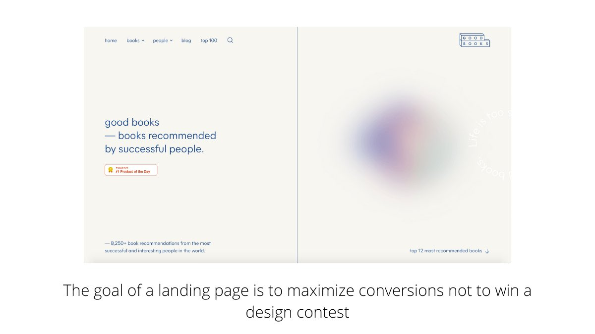

There is no benefit in the headline. What's in it for a random visitor that landed on the website for the first time?

The USP needs to be crystal clear to minimize bounce rate. I’d like to see something like: ”Find your perfect next read” or “Discover a book you’ll love.”
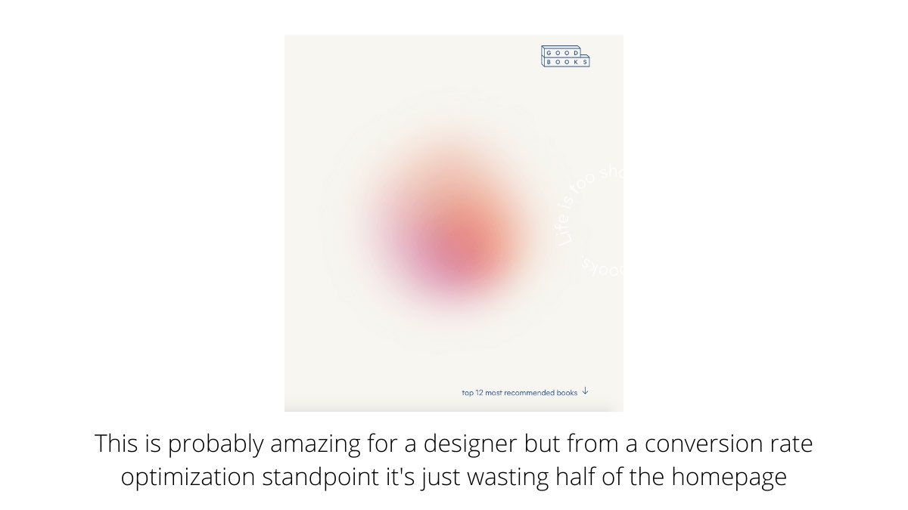

Instead of a CTA, there’s a link to the Product Hunt submission.

That would be ok only for the PH launch day, but right now, the goal should be sending people from PH to the site, not vice versa.

I’d use a clear CTA like “Start exploring” or “Take a look.”
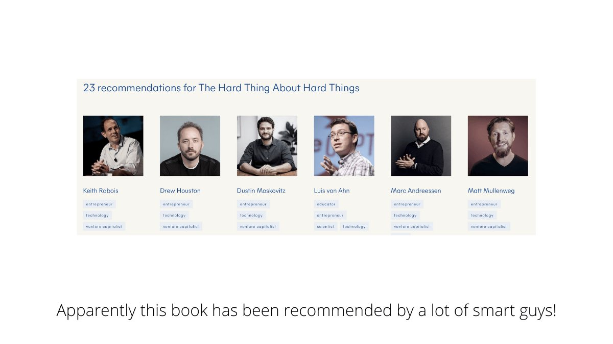

A lot of space on the homepage was wasted for the aesthetic.

All that space should’ve been used to give the visitor a sense of what the website is all about.

For example, moving the “top recommended books” section up, so visitors can immediately take action.
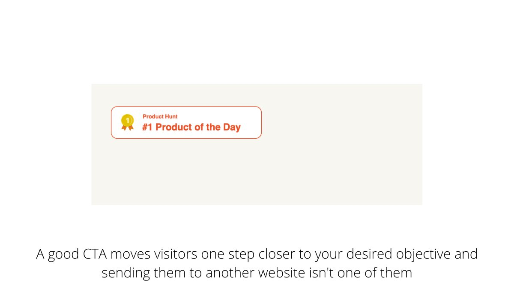

For a content website like this one, monetization isn’t easy.

Starting with affiliation is probably the wisest choice, although it probably won’t be very lucrative for a while.

Relying 100% on a single partner like Amazon is also quite risky.
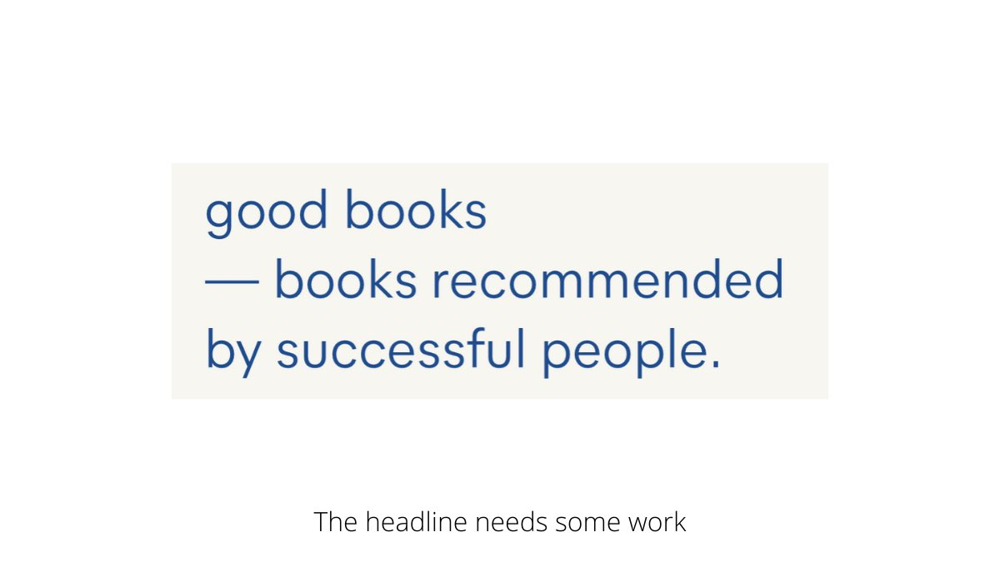

Good Books can’t only rely on new traffic. The key is turning as many random visitors as possible into frequent users through email.

Set up different email lists for each category, and motivate people to sign up to get personalized recommendations based on their interests.
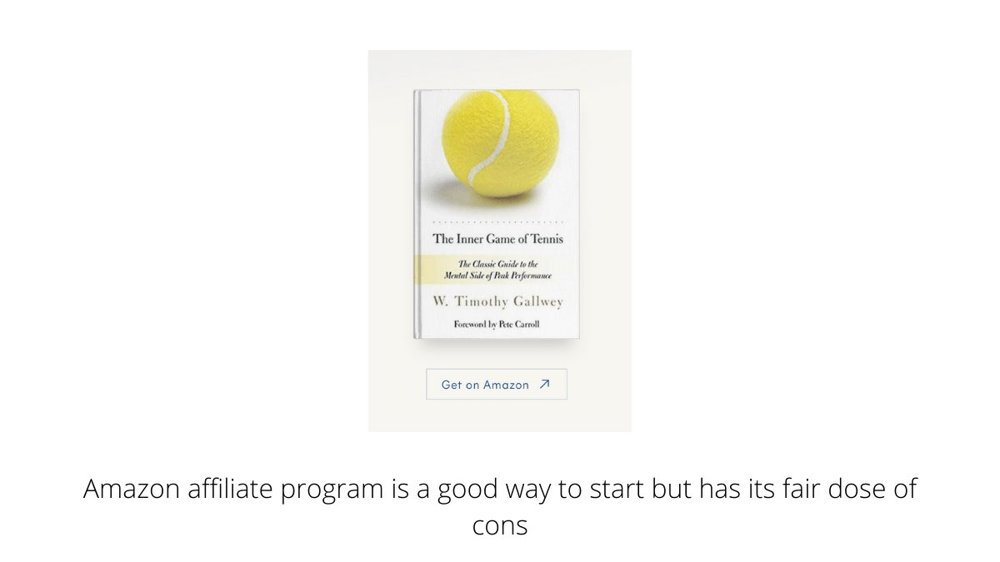

In the future, step 2 could be sponsors. Emerging authors would love to get their books in front of a targeted reader base.

Step 3 could be community. Once GB builds a loyal user base, they could offer access to a community of like-minded readers with exclusive benefits.
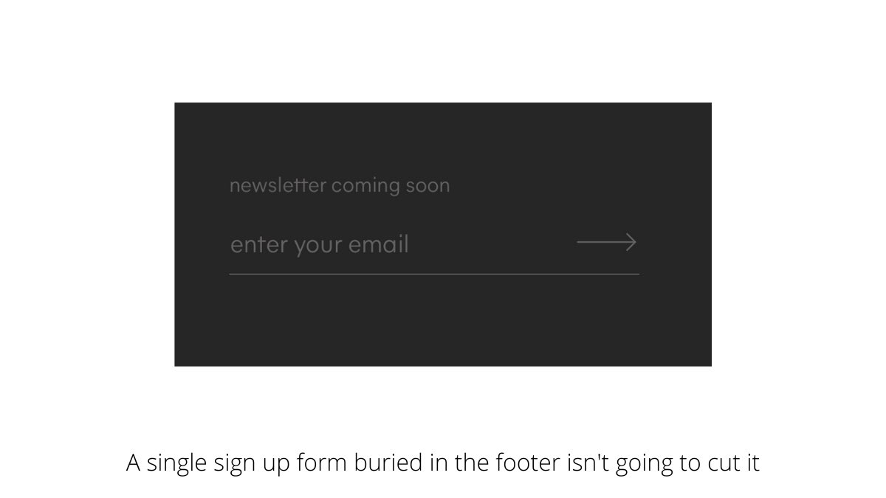

They had a great PH launch that drove the first batch of traffic, but as with every launch, it went dry after a few weeks. What now?

A website like this can’t afford paid ads. They need to create a system for getting a daily stream of free organic traffic from multiple channels.
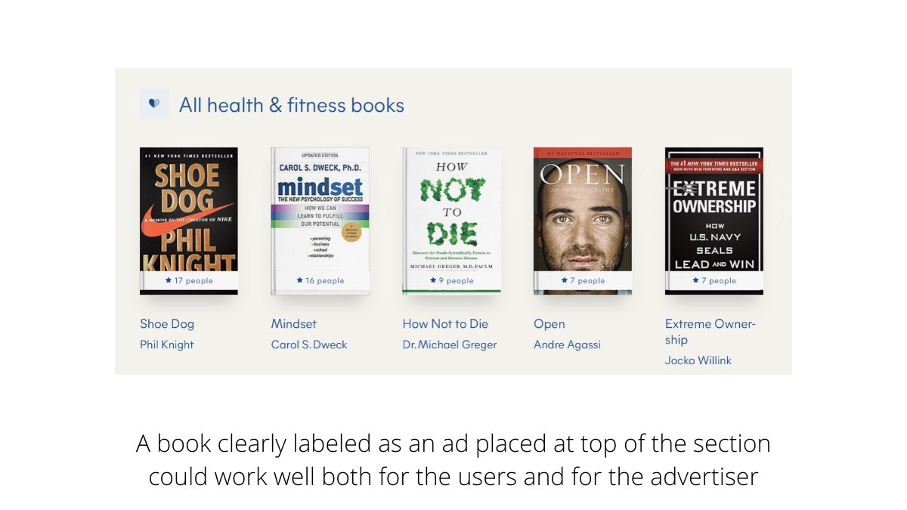

The first pillar needs to be word of mouth. It takes work, but works like a charm!

If they create a profile page for everyone considered “successful,” they can play the vanity angle and reach out to them, motivating them to share the page with their followers.
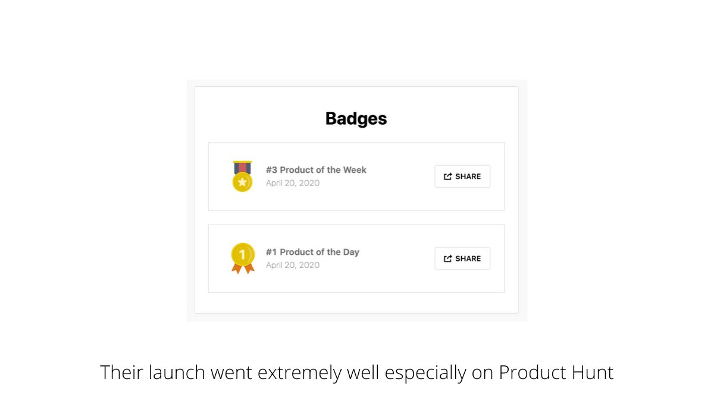

Create a social content strategy that works on all 3 networks: Twitter, IG and FB. A solo founder has no time to waste.

For example, post the cover of a different book every day, with a quote from the famous person explaining why they recommend that specific book.
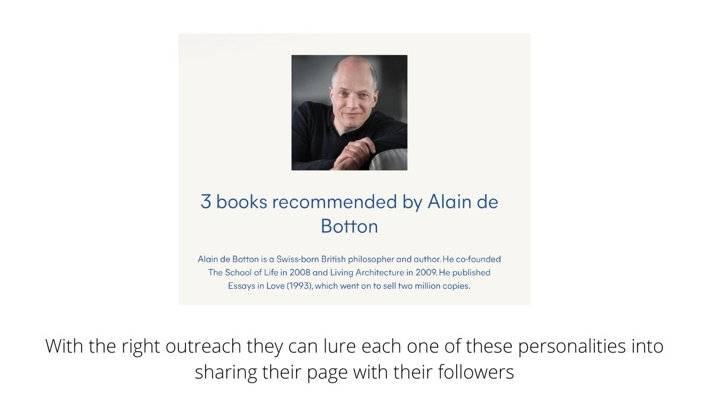

Pro tip: if you ask questions, you’ll get love from both followers and social media algorithms.

When a lot of people interact with your posts by answering your questions, your posts are prioritized in other people’s feeds. The snowball effect gives you a lot of reach.
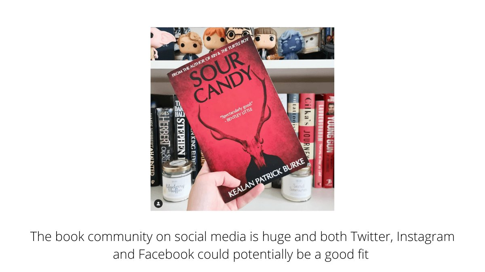

SEO is probably going to be the biggest traffic source in the long term, so GB has a few things to fix.

Before ranking a page, they should map the keywords right.

In this case, some of GB’s pages aren’t going to respond to search intent.
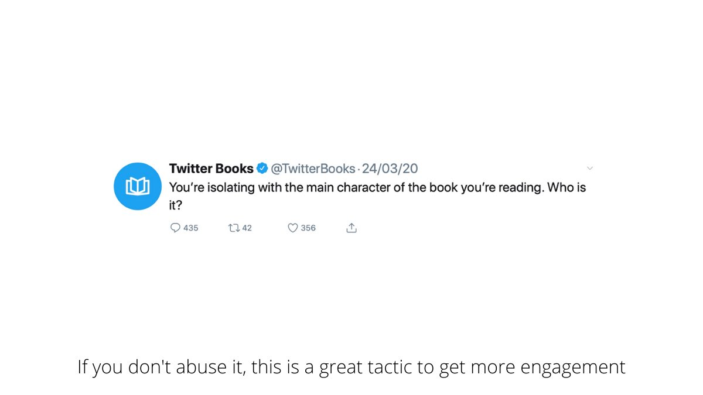

Once the keywords are ok, the question becomes: are GB’s pages better than their competition?

Their pages need more content to exceed the competition.

At least a paragraph explaining what the book is about, and a paragraph with a quote of the famous person’s recommendation.
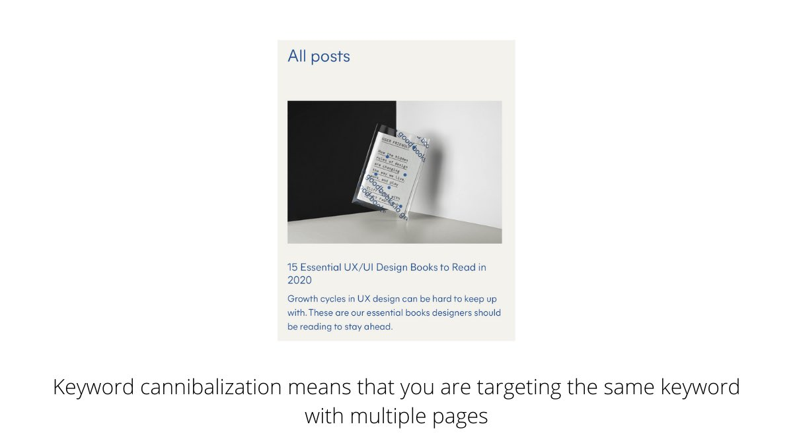

A blog is a great resource but it should target keywords different from the ones you use in your product and category pages, or you’ll confuse Google.

If you already have a page targeting “best design books,” you don’t want a blog post targeting “essential design books.”
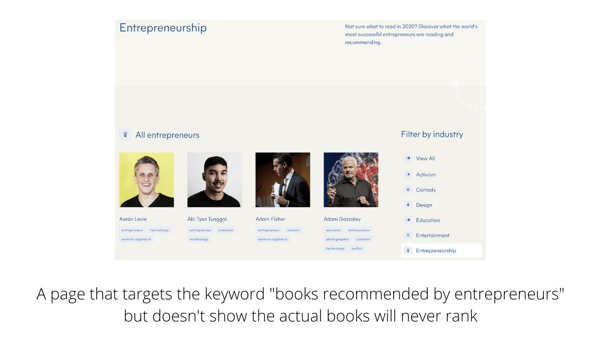
